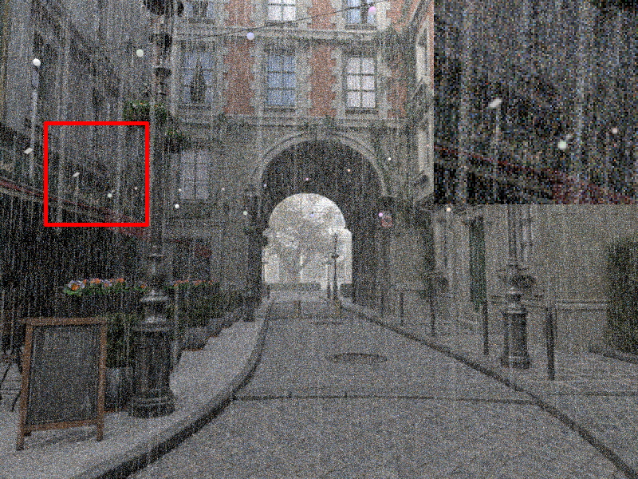
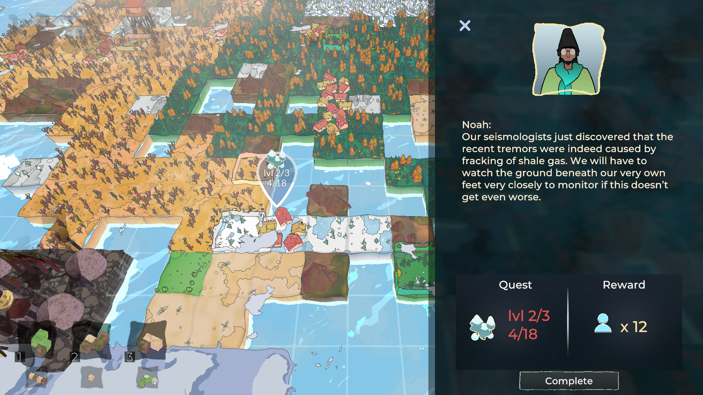
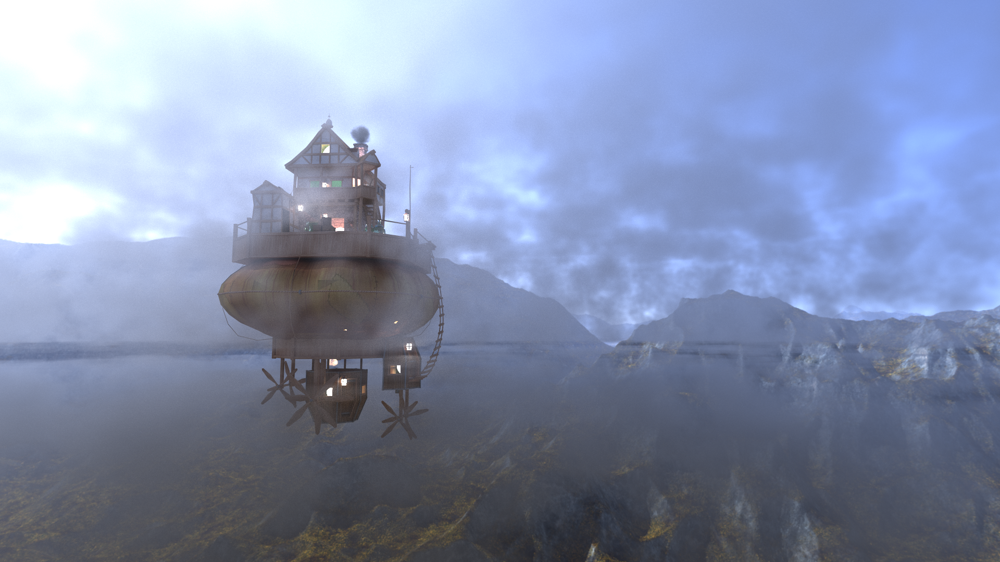
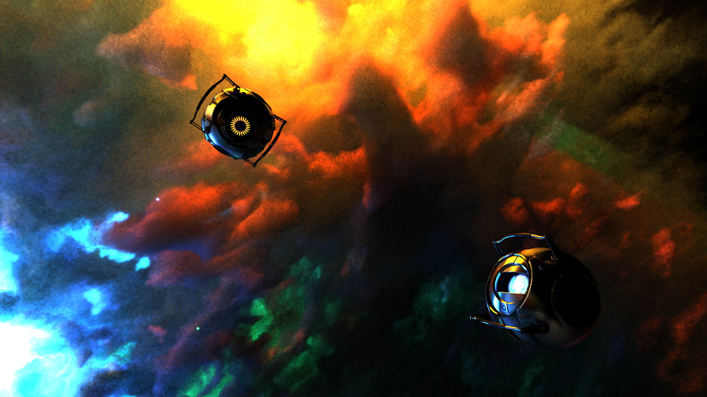
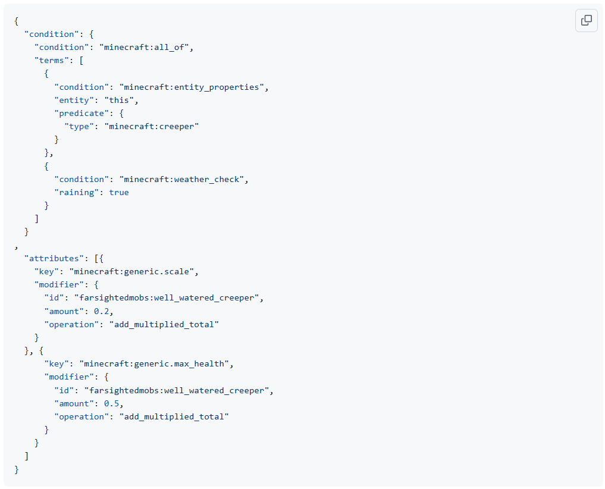
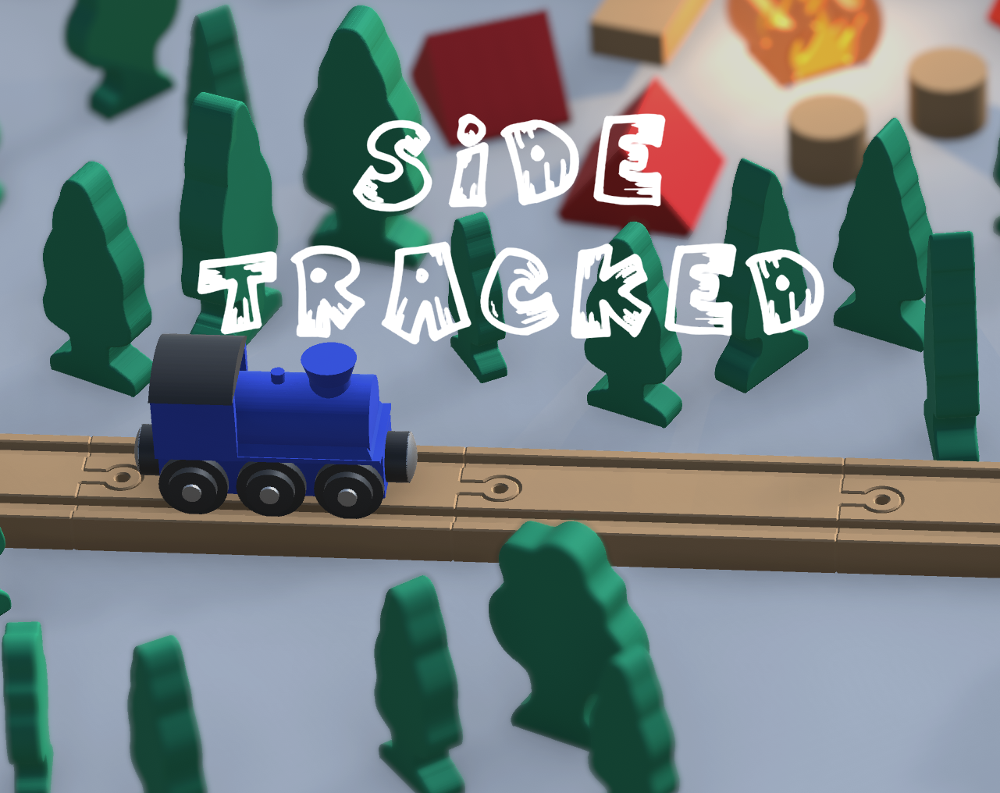
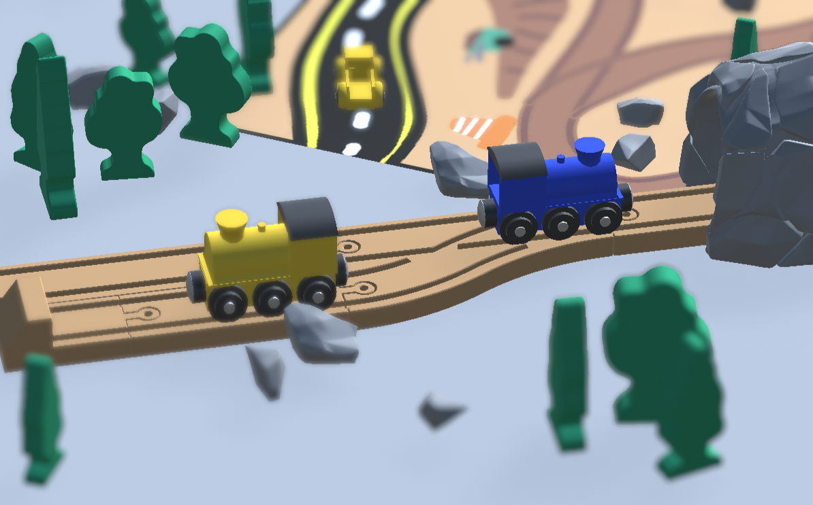
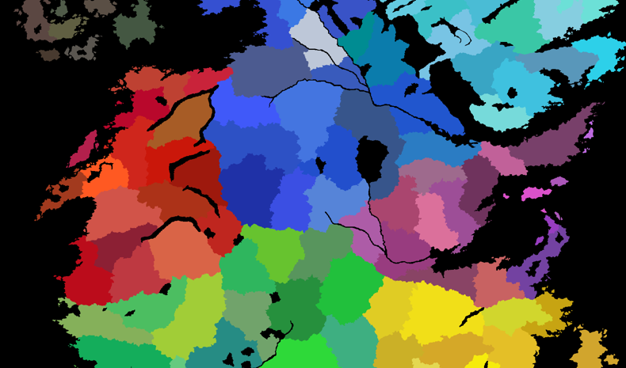
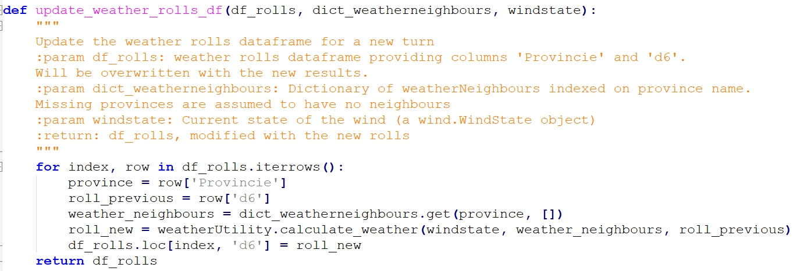
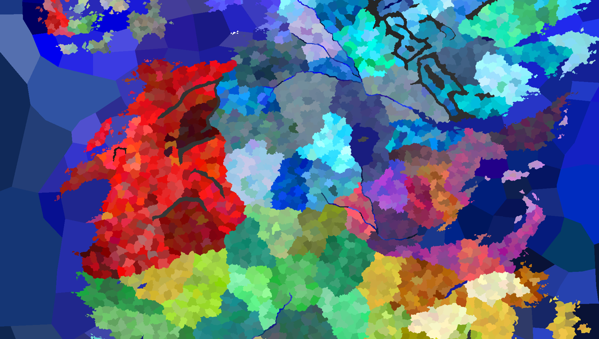

# Sindarin's Portfolio

This repository contains the source material for [my portfolio website](https://www.sindarin27.net). 

A rough draft of the things that will be shown and discussed in the portfolio is shown in the draft section of this document. It might be desirable to add code examples?

## Drafts

### Applying Volumetric Sampling Methods to the Rendering of Rain Droplets (2024)

I developed a new technique for rendering physically accurate rain streaks for my master thesis and implemented it in the rendering software [PBRT-4](https://www.pbrt.org/). 

Inspired by volumetric rendering techniques such as the one implemented in <a href="advancedgraphics.html">one of my previous projects</a>, I started researching the possibilities of using the same techniques to render rain streaks from a procedurally generated volume. In addition to researching more about existing volumetric rendering techniques, this included research into the physical properties of rain and the challenges these would present. I also implemented a ground truth algorithm to use for comparison with the method I was to develop.

The final implementation and math went smoothly and presented further optimisation possibilities by replacing the smallest rain drops with a uniform fog throughout the scene. The extra predictability presented by volume sampling allows a lot of noise reduction compared to the ground truth method, and allows the algorithm to run on the GPU. The method is still impractically slow for real-time rendering and requires further research to be fully physically accurate, but is currently one of the first approaches to rain rendering in the raytracing scene.

### Gaslit (2023)

At the request of Fossielvrij NL and in collaboration with a small team of artists and developers from the HKU Univeristy of Arts, I developed a casual game that introduces the player to the threat of the LNG industry to local communities. Time granted for this project was four months.

The player places tiles in the world to build a world, completing requests of communities scattered around the world by connecting landscapes of the same type. After some turns, an LNG terminal will appear and destroy part of the land. Gas fields will continue appearing and expanding, with pipelines connecting them to the terminals. This breaks up landscapes, which in turn makes quests harder to complete. The expansion of gas fields can also destroy communities, and if this happens too many times the player loses the game. The game has a scaling difficulty, such that the gas industry becomes more aggressive as more turns go by.

A Gaslit world is fully serializable and the player's progress is saved whenever they open the main menu, close the game, or when a set number of turns passes. All quests, upgrade tile locations, moves by the gas industry, and decorative objects use a seed randomly generated at the start of the game and saved to the file. To give a concrete example, this means the same community always has the same needs on the same save file — even if the community was not yet visible when the game last saved.

The game was developed in close collaboration with Fossielvrij NL by following Scrum guidelines, with a product increment delivered every two weeks to gather feedback and adjust our approach where necessary. 

This game can be played on https://fossielvrijnl.itch.io/gaslit.

Keywords: C#, Unity, Scrum, CI, Serious Games

### Raytracer from scratch (2023)

During the Advanced Graphics course, I developed a raytracer from scratch together with another student. The program can handle most types of OBJ models and can render the same using different algorithms, such as the Whitted algorithm and the Monte Carlo algorithm. 

After implementing the basic functionality for the raytracer and BVH, I implemented the paper "A null-scattering path integral formulation of light transport" by Miller *et al.* to render volumetric clouds in a scene, with the density of the cloud at a position determined using a custom cloud-generation algorithm developed by my teammate. 

Keywords: C#, RTX, GPU, PBR

### Farsighted Mobs Rework (2024)

Farsighted Mobs is one of my Minecraft mods, popular with modpack developers (people compiling a selection of mods and configuration settings to create a unique play experience) for its ability to make the game significantly harder by allowing monsters to see the player from further away. The only functionality in the mod when I created it in 2020 were the option to increase the default "follow range" of monsters, as well as adding individual overrides for certain creatures. I desired more flexibility and control, which is why I decided to rework the mod in October 2024.

Minecraft includes a predicate system used to generate loot when a chest is opened or a creature is killed in the base game, and designed to be extremely flexible. By incorporating this predicate system to determine whether a creature should be affected by my mod, modpack developers are granted the same options, and any future predicates added to the base game will automatically be accessible to the mod. Any predicates added by other mods will also be available to users of my mod, and my mod includes a small number of predicates which can thus be used for loot generation too.

The game also uses an attribute system for creatures: each creature is assigned attributes for things such as follow range, health, size, et cetera. The original mod only affected the follow range to make mobs see the player from further away, but the same approach can be used to affect other attributes — including attributes added by other mods or introduced in future versions of the game.

The combination of these two features creates an extremely flexible and modular system. The default behaviour of the mod is only slightly changed: the distance monsters see players from now depends on the difficulty of the game. But the new configuration options allow for nearly anything, from spawning animals with less health on a player's first day to spawning larger monsters during a full moon.

### Side Tracked (2024)

Side Tracked is a small game about wooden trains, which I created during a single-weekend game jam. The game has the player dragging around a small train over a wooden train track, passing through a number of environments on their way. 

With the primary mechanic of the game being the dragging of the train along its rail, most of my effort was devoted to making this mechanic work smoothly and feel satisfying to the player. This included experimentation with the hitbox of the train (where should the player be able to click for the train to respond?), how fast the train should move, how far the mouse pointer could deviate from the track for the train to move, where the train should move if the player's mouse is not directly on the track, et cetera. Equally important was ensuring a smooth transition between tracks, and providing feedback to the user when the train could not move.

The game features a simple save system so a player can leave after completing a level or replay a level they have already completed. Although the project was created during a game jam, the code is modular enough that future levels could be added if I ever wish to continue development on the game.

Although the game was brought to a completed state for the game jam, there are still many levels I wished to add to the game but did not have time for, and the levels currently in the game function mostly as an introduction to mechanics I wished to use in more complicated puzzles. A single weekend is very little time to create a full game, it turns out! Nevertheless, I am very happy with the result, and the game was voted as winner of the game jam.

This game can be played on https://sindarin27.itch.io/side-tracked.

Keywords: C#, Unity, Game jam, Web game

### A Song of Ice and Fire Roleplaying Tool (2024)

I developed an unofficial tool for the Song of Ice and Fire Roleplaying game with a small team of friends from a data science and economics background. This tool assists the game masters ("referees" running the game) with keeping a high-level overview of the game world, simulating things such as weather, food, and troop movement that would otherwise take a lot of manual work. The project was split into multiple modules that communicate through the file system. I worked on the modules for weather simulation and food production and consumption, a tool to convert maps to a format usable with the tool, as well as the central module that controls when the other modules should activate. Troop movement and the written specifications of each module were handled by the rest of the team. 

In case of both the weather and food modules, data management was the primary challenge. Data had to be stored in a format usable for all modules (for example, food production depends on the weather) as well as readable for the game masters (for example, the game master wants to tell a player how many weeks of food are in their castle), which is why the choice was made to use CSV files for all modules. Both modules used a central interface with functions for reading, updating, and writing the files available to the other modules, as well as a number of utility methods to handle their own internal logic to update the state of the world.

To avoid the manual labor of drawing our own map or interpreting a map designed for humans rather than computers, I designed the map conversion tool to create and visualise a map from files present in the Crusader Kings 3 conversion mod "A Game of Thrones", set in the same world as the roleplaying game. This map contained nearly 7000 regions, far too much for our game, but also contained files describing a hierarchy of regions. My tool reads these files, traverses the hierarchy, and builds a new map at a scale with larger regions. My weather module additionally needed information about the borders between regions, so I added a step to the conversion program to detect all borders and their direction using a number of image processing techniques. These borders are written to an additional CSV file, allowing game masters to make the final call on borders: for example, a border might want to be removed due to a large mountain range separating the two regions physically.

The central module handles the communication between the game master and the other modules. This module makes calls to all other modules to update the state of the world based on input by the game masters. 

The tool was used live during a week-long game and the game masters considered the tool a great success, reducing their workload even further than the Excel sheets used in previous games and considering to automate even more parts of the game in the future.

Keywords: Python, Data management, Image processing